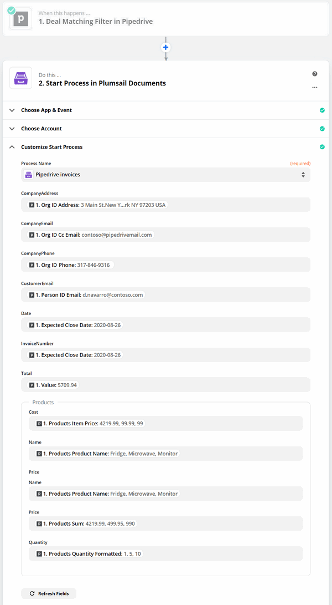

.. title:: Create custom documents from Pipedrive Sales CRM with Plumsail Documents integration in Zapier

.. meta::
   :description: Generate invoices for won Pipedrive deals and automatically send to customers by email.

How to automatically generate Word and PDF invoices for deals in Pipedrive Sales CRM
====================================================================================

This article describes how to boost productivity by connecting `Pipedrive Sales CRM <https://www.pipedrive.com/>`_ to the document generation process. In this particular case, we’ll auto-generate invoices for deals in Pipedrive. 
The same approach is suitable for creating any documents from templates of any formats – Word, Excel, PowerPoint, or fillable PDF – based on Pipedrive data. 

With the help of `Zapier <https://zapier.com/>`_, we’ll connect Pipedrive to `Plumsail Documents <https://plumsail.com/documents/>`_ to gain the goal – to automatically fill in an invoice Word template once the Pipedrive deal is won, convert to PDF, and send to the customer. 

So, let’s move step by step.

.. contents::
    :local:
    :depth: 2

Configure document generation process
~~~~~~~~~~~~~~~~~~~~~~~~~~~~~~~~~~~~~

Before we proceed to connect Pipedrive to the document generation process in Zapier, we need to create and configure this process. 
It will generate a PDF invoice from a Word template and will send the resulting document to the customer. 

Create new process
------------------
To start, go to `the Processes section <https://account.plumsail.com/documents/processes>`_ in your Plumsail account. If you haven't a one yet, then `register a new Plumsail account <https://auth.plumsail.com/Account/Register?ReturnUrl=https%3A%2F%2Faccount.plumsail.com%2Fdocuments%2Fprocesses>`_.

Click on the *Add process* button.

.. image:: ../../../_static/img/user-guide/processes/how-tos/add-process-button.png
    :alt: add process button

Give a name to the process. Upload a blank DOCX file or a prepared-beforehand template. 

.. image:: ../../../_static/img/user-guide/processes/how-tos/pipedrive-process.png
    :alt: Pipedrive invoices process

DOCX invoice template
*********************

Feel free to `download an invoice template <../../../_static/files/user-guide/processes/pipedrive-invoice.docx>`_ which we're going to use. 

This is how it looks:

You may see :code:`{{tokens tags}}` in the template. They let the templating engine know where to apply your specified data. 
In our case, the most basic is :code:`invoiceNumber` and :code:`date` tags. They show to the engine that we want to render the invoice number and its date.

For sure, it's possible to implement more complex scenarios. In our template, we refer to properties inside simple objects and collections, as well as properties in nested constructions. To select properties of our objects inside of the array (in JSON data), we use a dot operator:

- The :code:`{{company.address}}`, :code:`{{company.email}}`, :code:`{{company.phone}}` tags let the engine know that we want to render properties of the company object.
- The :code:`{{product.name}}`, :code:`{{product.quantity}}`, :code:`{{product.price}}`, and :code:`{{product.cost}}` tags get the name, description, and price properties in each product object.

The templating engine is smart enough to identify what content to duplicate. It will iterate through all objects in the array to render them and add the rows automatically.

You can learn more about table rendering in `the tables section <../../../document-generation/docx/tables.html>`_ of the documentation.

Configure template
------------------

After you've created the process, you find yourself on its first step - **Configure template**.

The step includes two substeps:

- Editor;
- Settings.

In `Editor <../../../user-guide/processes/online-editor.html>`_, you can work on the template - modify it and instantly check how the changes affect the result. 

For that, click on the *Test template*. You'll see the dialog where you need to insert some data in JSON format. This data represents what the templating engine should paste into :code:`{{brackets}}` instead of object names and their properties. So, this data needs to correspond to tokens from the template.

To test the invoice template from this example, copy and paste the JSON data presented below.

.. note:: This is JSON for testing. We will pass data from Pipedrive to our process. See the `Start process section <#start-process>`_. 

.. code:: json

    {
      "invoiceNumber": "432",
      "company": {
        "email": "sales@sample.com",
        "address": "3 Main St.New York NY 97203 USA",
        "phone": "202-555-0131"
      },
      "date": "2018-05-21",
      "product": [
        {
          "name": "Fridge",
          "price": 4219.99,
          "quantity": 1,
          "cost": 4219.99
        },
        {
          "name": "Microwave",
          "price": 99.99,
          "quantity": 5,
          "cost": 499.95
        },
        {
          "name": "Monitor",
          "price": 99,
          "quantity": 10,
          "cost": 990
        }
      ],
      "total": 18872.94
    }

Once you're satisfied with the result, press *Save&Next* to proceed further - to the **Settings** substep.

There you can set the parameters as described below the picture.

**Template mode**

It is *Testing* by default. It means you won't be charged for this process runs, but result documents will have a Plumsail watermark. Change it to *Active* to remove the watermark.

**Output filename**

Use tokens to make it personalized. They work the same way as in the template. 

**Output type**

By default, it is the same as your template's format. In this particular case, it's DOCX. We're changing it to PDF to receive the resulting invoice in PDF.

.. hint:: You can `protect your final PDF document with a watermark, by setting a password, or disabling some actions <../configure-settings.html#add-watermark>`_. 

**Test template**

You can test the template from the Settings as well - to check how the customized settings will appear in the resulting document. The procedure is the same as we've already described above.

Delivery
--------

The next step is delivery. In this example, we'll set an email delivery to send the invoice to the customer. You can add as many deliveries as you need - please, check out the `full list of available deliveries <../../../user-guide/processes/create-delivery.html>`_.

To adjust the email delivery to our needs, we put token :code:`{{email}}` as a recipient's email address. It will adjust dynamically every time according to the data pulled from Pipedrive.

We filled in the subject and email body. Additionally, it's possible to expand Advanced settings to customize *Display name* and *Reply-to*. The default display name is *Plumsail Documents Delivery*. The default reply-to is the currently logged-in user's email.

Start process
-------------

We'll start our process from Zapier.

Create Zap
~~~~~~~~~~

Zap is an automated connection between web services in Zapier. 
Every Zap has a trigger - an event that makes this Zap launch. And after the trigger, an action or a series of actions to perform. 

In our case, the zap is a two-step - trigger plus action. This is how it looks:

Below is a step-by-step description.

Deal matching filter in Pipedrive
---------------------------------

This trigger will check the status of Pipedrive deals. Once it's won, the zap will start to generate a customized invoice and send it to customers by email.

When using the Pipedrive integration for the first time, you'll need to login to your Pipedrive account from Zapier. 

The next step is **Customize Deal**. We set the filter - *All won deals*.

Continue and test the trigger to find data to be able to use the Pipedrive output in the next step.

Start process in Plumsail Documents
-----------------------------------

Now add a *Start process* action from the `Plumsail Documents integration <https://zapier.com/apps/plumsail-documents/integrations>`_.

Click Continue. If this is your first Zap, at this point, you'll need to sign in to your Plumsail Account from Zapier to establish a connection between the app and your account. If you already have a Plumsail account tied to the app, you can add another one at this step, and use it instead.

Customize Start Process
***********************

Choose the process you want to start by this Zap from the dropdown. 
In our case, it's Pipedrive invoices.

You may see fields to complete - they have the same names as tokens from the template. Actually, these fields are created based on the tokens. 

To fill in them, use the output from the Pipedrive trigger. Zapier outlines nested objects and arrays.

It's not a problem to create a document with a bunch of line items (products) as Plumsail Documents integration supports it. 

Note, that for the invoice number we inserted the date. It will transform to the format we set in the template - :code:`yyMMdd`. You can choose any other output field for the invoice number.

Our zap is done. In case you need some advanced logic, you can continue building the zap and use the generated invoice in the next actions. 

For our scenario, that's it. Once the Pipedrive deal is won, the customer will receive the personalized email with the invoice attached. 

Try the described approach to generate other documents based on data from Pipedrive. 

Sign up for Plumsail Documents
~~~~~~~~~~~~~~~~~~~~~~~~~~~~~~

Document automation could save tons of time, human resources, ok, and even preserve your nerves 🙂

`Sign-up for Plumsail Documents <https://auth.plumsail.com/Account/Register?ReturnUrl=https://account.plumsail.com/documents/processes/reg>`_ - it provides a 1-month free trial subscription. 

