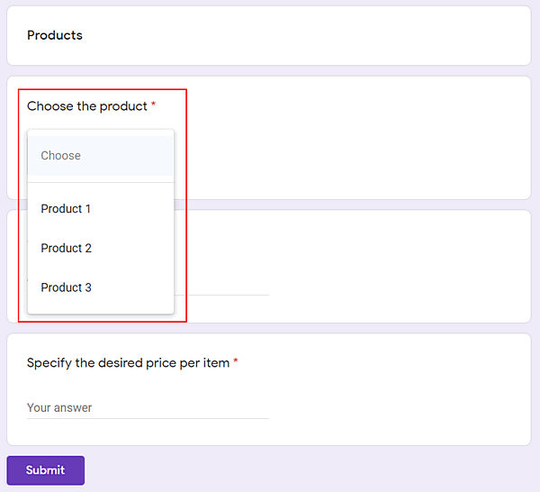
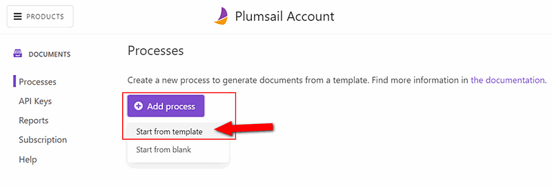
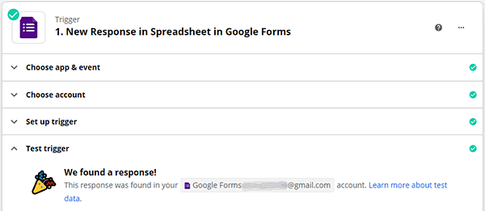

.. title:: Populate document templates with Google Forms data automatically with Plumsail Documents in Zapier

.. meta::
   :description: How to create custom PDF, Word, Excel, or PowerPoint documents from templates on Google Forms submission

Generate PDF documents from Google Forms and automatically save results to Google Drive
=======================================================================================

From this article, you will learn how to generate PDF documents with you Google Forms data 
and automatically save the resulting documents to Google Drive. 

`Google Forms <https://forms.google.com>`_ allow you to build online forms that you can publish on your website or anywhere else. 
Otherwise, you can share the link leading to the form.

`Plumsail Documents <https://plumsail.com/documents/>`_ automates generating documents from templates and delivering resulting documents. 

In this example, we’ll create a PDF purchase order from an Excel template and store the result into Google Drive. 
We'll connect Google Forms to Plumsail Documents with the help of the `Zapier platform <https://zapier.com/>`_. 

.. contents::
  :local:
  :depth: 1

Prepare online form in Google Forms
~~~~~~~~~~~~~~~~~~~~~~~~~~~~~~~~~~~~

Using the Google Forms builder, we’ve prepared such an `online form for a purchase order <https://forms.gle/jeYBMXo8bv3qNq3T9>`_. 

The online form builder by Google Forms is easy to use. You add new fields and specify their types. We have a short text type for almost all fields. Also, we added a date field. 

And a dropdown for choosing products.

Create document generation process in Plumsail Documents
~~~~~~~~~~~~~~~~~~~~~~~~~~~~~~~~~~~~~~~~~~~~~~~~~~~~~~~~

`Sign up for a 30-day free Plumsail Documents trial <https://auth.plumsail.com/Account/Register?ReturnUrl=https%3A%2F%2Faccount.plumsail.com%2Fdocuments%2Fprocesses>`_. 
If you already have a Plumsail account, then open the Processes section.

Add a new process and select ‘Start from template’. 

Then choose the purchase order template from the document templates library. 

You can adjust premade document templates to your needs. For editing online, click on 'Edit online'.

Or use the 'Download' and 'Upload' buttons to edit it locally on your PC.

You can create your own document templates and upload them to the document generation process. 
Plumsail Documents templating language is easy to understand and implement.
Everything you enclose in :code:`{{double curly brackets}}` will be replaced by custom data. 
There are many advanced features in Plumsail Documents templates such as lists, tables, charts, and more, and even QR codes and barcodes. 

Please, learn how Plumsail Documents templating language works for various formats:

- `Word <https://plumsail.com/docs/documents/v1.x/document-generation/docx/index.html>`_
- `Excel <https://plumsail.com/docs/documents/v1.x/document-generation/xlsx/index.html>`_
- `PowerPoint <https://plumsail.com/docs/documents/v1.x/document-generation/pptx/index.html>`_
- `Fillable PDF <https://plumsail.com/docs/documents/v1.x/document-generation/fillable-pdf/index.html>`_

For simplicity here, we leave the premade template of the purchase order as-is. 

Only in the Settings, we configure to get the output document in PDF. And enable Active mode to remove the Plumsail watermark from the resulting documents. 

Add Google Drive delivery
--------------------------

We proceed to add delivery to our document generation process. We’ll store completed purchase orders in Google Drive. 

For that, select the Google Drive delivery.

Sign in to your Google account from the Plumsail account. Specify the folder where to store the resulting documents. That’s it.

.. image:: ../../../_static/img/user-guide/processes/how-tos/google-drive-delivery-settings-google-forms.png
  :alt: settings of google drive delivery

You can add ad many deliveries as you need. 
For instance, in addition to storing in Google Drive, you can send the resulting documents by Gmail. 

We’re moving further. The next step is to start the process we’ve created. 

Connect Google Forms to Plumsail Documents in Zapier
~~~~~~~~~~~~~~~~~~~~~~~~~~~~~~~~~~~~~~~~~~~~~~~~~~~~~
  
We'll trigger our process by Google Forms submission. For that, we need to create a Zapier automated connection of apps. It's called Zap.

Click on the 'Use this zap' button to utilize the zap template.

|Widget|

.. |Widget| raw:: html

    

This is how our Zap looks:

Below is a step-by-step description.

Trigger - New Response in Spreadsheet in Google Forms
------------------------------------------------------

To be able to use this trigger in Zapier for a particular form, don't forget to connect the form to the spreadsheet. 
You can do it in Responses by clicking on the Spreadsheets icon.

Select 'New Response in Spreadsheet' as a trigger if you're creating the zap from scratch.

To configure it, sign in to your Google account from Zapier. Then select the form you’d like to track and the corresponding spreadsheet.

Don't skip testing the trigger. You'll need the testing data further while setting the zap.

Action - Start Process in Plumsail Documents
---------------------------------------------

For an action, select the Plumsail Documents app and its 'Start process' action.

Sign in to your Plumsail account from Zapier to be able to configure the action. 
On the 'Set up action' step, you need to select the document generation process you'd like to start.
Then map data from Google Forms with document template tokens. Fill in each token field with corresponding data from Google Forms.

Now you can turn on your zap. Every time somebody submits the Google form with the purchase order, you'll get a PDF document in your Google drive. 

Hope you'll like this automation. Plumsail Documents works well with lots of other web forms. 

`Check the integrations for more ready-to-use examples <https://plumsail.com/documents/integrations/category/forms-and-surveys>`_. 

