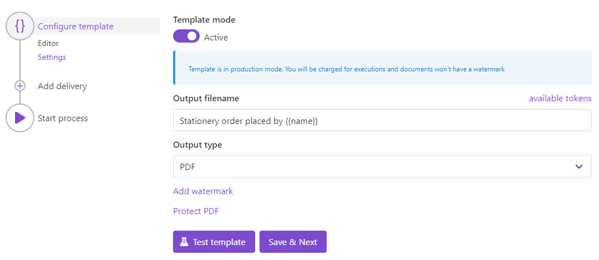

Configure the Process
---------------------

Now we need to create and configure the Process which will generate stationery requests in PDF format based on data from our web form submission. 

Create a new Process
~~~~~~~~~~~~~~~~~~~~

Go to `the Processes section <https://auth.plumsail.com/account/Register?ReturnUrl=https://account.plumsail.com/documents/processes/reg>`_ in your Plumsail account.

Click on the *Add process* button.

.. image:: ../../../_static/img/user-guide/processes/how-tos/add-process-button.png
    :alt: add process button

Set the Process name. As we're going to generate PDF stationery orders from an Excel template, select XLSX for the template type.

.. image:: ../../../_static/img/user-guide/processes/how-tos/create-excel-process.png
    :alt: create excel process

Configure a template
~~~~~~~~~~~~~~~~~~~~

Once you're done with the first step *Create Process*, press the *Next* button, and you’ll proceed to the next step – *Configure Template*.

It includes two substeps:

- Editor;
- Settings.

In `Editor <../../../user-guide/processes/online-editor.html>`_, you can compose the template from scratch or upload a pre-made one. It's also possible to modify the uploaded template online.

Feel free to `download an XLSX stationery order template <../../../_static/files/flow/how-tos/Create-Word-and-XLSX-template.xlsx>`_ that we have already prepared:

.. image:: ../../../_static/img/flow/how-tos/Cognito-Forms-XLSX-PDF-Template.png
    :alt: Template

Then upload it to the process.

.. image:: ../../../_static/img/user-guide/processes/how-tos/upload-template.png
    :alt: upload template file

Templating syntax
*****************
When creating your own templates, mind the templating language. Plumsail Excel XLSX templates use a different approach than most other templating solutions. It uses a minimal amount of syntax to make your work done.

In short, the templating engine thinks that everything between curly :code:`{{ }}` brackets is variables where it will apply your specified data. 
Read `this article <../../../document-generation/xlsx/how-it-works.html>`_ to get familiar with the templating engine.

Test template
*************

To check how the document will look at the end, click on the *Test template* button. 

You will see the dialog where you can fill in the auto-generated testing form. 
Form fields are created based on tokens from your document template. You can `adjust the look of the testing form by changing token types <../custom-testing-form.html>`_.

.. image:: ../../../_static/img/flow/how-tos/test-template-cognito-xlsx.png
    :alt: test template

It’s testing. We’re going to apply the data from the web form to our template.

Once you've tested the template, press *Save&Next* to proceed further - to the **Settings** substep.

Here, please:

- Switch to an active mode to remove Plumsail watermarks from resulting documents
- Fill in the name of the result file
- Select PDF format for the output file
- `Protect the result PDF <../configure-settings.html#add-watermark>`_ if you wish

Once you've customized all the settings, you can test the template to see the result as we did it before. 

When everything is done here, click on Save & Next to set up deliveries.

Delivery
~~~~~~~~

The next step is delivery. For demonstrating purpose, we’ll store the result file in `OneDrive <../../../user-guide/processes/deliveries/one-drive.html>`_. But there are `other options <../../../user-guide/processes/create-delivery.html#list-of-available-deliveries>`_.

Just set the folder's name where the ready document will be saved.

.. image:: ../../../_static/img/flow/how-tos/onedrive-forms.png
    :alt: create pdf from template on form submission

You can configure as many deliveries as you need.