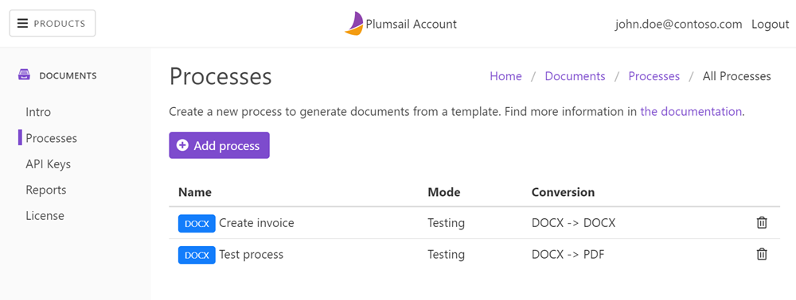

.. meta::
  :description: Create customized documents from templates, convert, and deliver the result to your system in a few steps. Try processes in Plumsail Documents.

Processes
=========

Processes are an easy way to automate the creation of documents from templates. You can generate and deliver documents in a few simple steps.

Getting started
~~~~~~~~~~~~~~~

.. toctree::   
  :name: toc-processes  
  :titlesonly:
  :maxdepth: 1
    
  create-process
  edit-test-template
  configure-settings
  create-delivery
  start-process

Advanced
~~~~~~~~

.. toctree::   
  :name: toc-processes-advanced
  :titlesonly:
  :maxdepth: 1

  runs-history
  online-editor

Processes examples
~~~~~~~~~~~~~~~~~~

.. include:: /user-guide/processes/examples.rst

Find more examples in the integrations:

- `All <https://plumsail.com//documents/integrations/>`_
- `eSignature <https://plumsail.com//documents/integrations/category/esignature/>`_
- `Forms & Surveys <https://plumsail.com//documents/integrations/category/forms-and-surveys/>`_
- `Sales & CRM <https://plumsail.com//documents/integrations/category/sales-and-crm/>`_
- `Commerce <https://plumsail.com//documents/integrations/category/commerce/>`_
- `Communication <https://plumsail.com//documents/integrations/category/communication/>`_
- `Content & Files <https://plumsail.com//documents/integrations/category/content-and-files/>`_
- `Human Resources <https://plumsail.com//documents/integrations/category/human-resources/>`_
- `Marketing automation <https://plumsail.com//documents/integrations/category/marketing-automation/>`_
- `Analytics & Reporting <https://plumsail.com//documents/integrations/category/analytics-and-reporting/>`_
- `IT & Engineering <https://plumsail.com//documents/integrations/category/it-and-engineering/>`_
- `Productivity <https://plumsail.com//documents/integrations/category/productivity/>`_
- `Customer support <https://plumsail.com//documents/integrations/category/customer-support/>`_   

.. note::

  Processes work for most of the scenarios. If you want some advanced operations on documents, take a look at our `Power Automate (Microsoft Flow) actions <../../getting-started/use-from-flow.html>`_ and `REST API <../../getting-started/use-as-rest-api.html>`_.