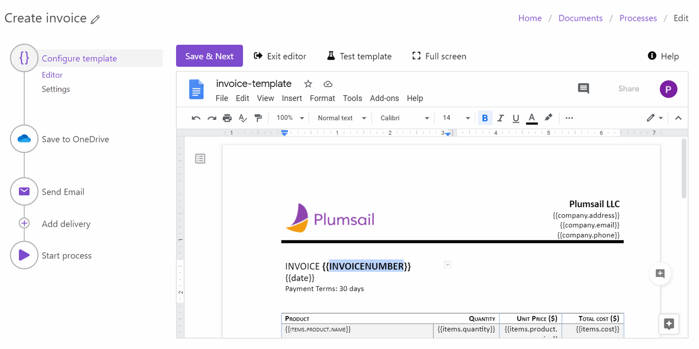
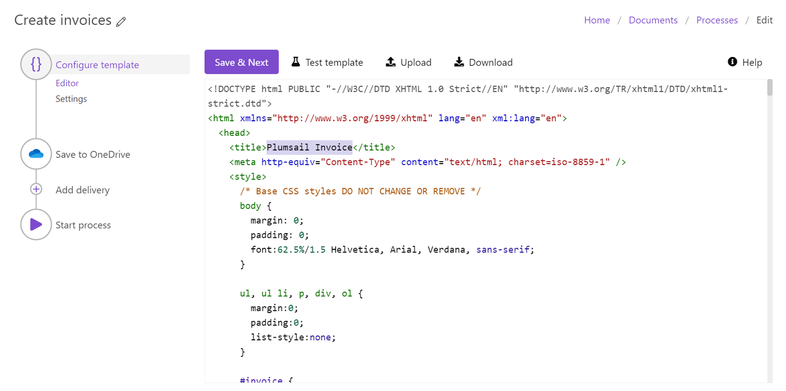

Online editor
=============

The `Configure template step <./create-process.html>`_ includes an online editor for templates. 
It allows you to change document templates online in your Plumsail account and check how these changes affect the result. 
Let’s review how it works.

To enter the Online editor, click on the *Edit online* button from the Editor substep. Once you’ve entered the Online editor, you’re able to change the document template. 

Switch to a full-screen mode and back by simply clicking on the button.

.. image:: ../../_static/img/user-guide/processes/full-screen-buttons.png
    :alt: Full screen and Exit full screen buttons

Test the document template to check how made changes will affect the resulting file. 

.. image:: ../../_static/img/user-guide/processes/test-button-template.png
    :alt: Test template button in Online editor

Proceed to the instruction on `how to test templates with your data <./test-template.html>`_.

Editing of Office document templates
------------------------------------

Online editor for Word, Excel, and PowerPoint templates is supported by Google Docs. 

Edit Word DOCX templates:

Edit Excel XLSX templates:

Edit PowerPoint PPTX templates:

.. important:: Exit the online editor means you confirm the changes. After exiting you won’t be able to undo changes, just make new ones.

Editing of HTML templates
-------------------------

Online editor for HTML templates uses CodeMirror with HTML Mixed mode. You can make changes to your HTML template right in the working area. 

.. hint:: Plumsail Documents processes support fillable PDF forms as templates as well. You can't edit the PDF form template inside the process, but you can create it the way you need beforehand. Check out our instruction on `how to create fillable PDFs <../../document-generation/fillable-pdf/index.html>`_.