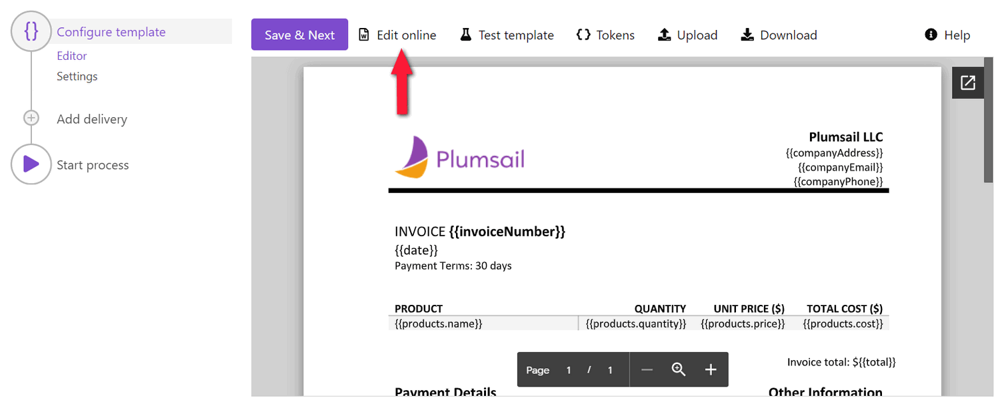
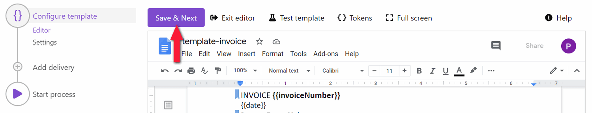

Online editor
=============

The online editor allows you to create document templates and edit them online right in the `Plumsail process <./index.html>`_. Instantly you can check how the resulting document will look. 
Let’s review how it works.

.. contents::
    :local:
    :depth: 2

Start online editor
~~~~~~~~~~~~~~~~~~~

The editor mode in the Configure template step appears with the preview for Office document templates. To start working on the document template online, click on the *Edit online* button:

If you're working on the HTML template, you're able to make changes right away, because there is no preview mode:

.. image:: ../../_static/img/user-guide/processes/edit-html-template.png
    :alt: Edit HTML html template

.. note:: No online editor is available for fillable PDF form templates. You'll have only its preview on this step. You can consult our detailed description of `how to create fillable PDFs <../../document-generation/fillable-pdf/index.html>`_. 

Complex Office document templates
~~~~~~~~~~~~~~~~~~~~~~~~~~~~~~~~~

Online editor for Word, Excel, and PowerPoint templates is supported by Google Docs. 
That's why you may encounter incompatibilities for certain Microsoft Office features. 
For example, it will likely break watermarks, inserted pictures' rotation or opacity.

We recommend you to work on complex document templates outside the process online editor. Use Upload/Download buttons for it:

.. image:: ../../_static/img/user-guide/processes/upload-download-button.png
    :alt: Edit HTML html template                

Full-screen mode
~~~~~~~~~~~~~~~~

The online editor provides a full-screen mode for more convenience in working with the template.  
Switch to a fullscreen and back by simply clicking on the button.

**Go to fullscreen**

.. image:: ../../_static/img/user-guide/processes/full-screen-button.png
    :alt:  Full screen button

**Exit fullscreen**

.. image:: ../../_static/img/user-guide/processes/exit-full-screen.png
    :alt:  Exit full screen button

Test the document template
~~~~~~~~~~~~~~~~~~~~~~~~~~

You can instantly check how all your modifications to the template will affect the resulting file. It's possible to test the template right from the online editor:

.. image:: ../../_static/img/user-guide/processes/test-button-template.png
    :alt: Test template button in Online editor

Proceed to the instruction on `how to test templates with your data <./test-template.html>`_.

Save the template
~~~~~~~~~~~~~~~~~

You can switch between preview and edit modes by clicking *Edit online* and *Exit editor*. But none of the changes will pass to the process until you press *Save&Next*. To confirm you're satisfied with the template result and ready to go to the next step, click on this button:

