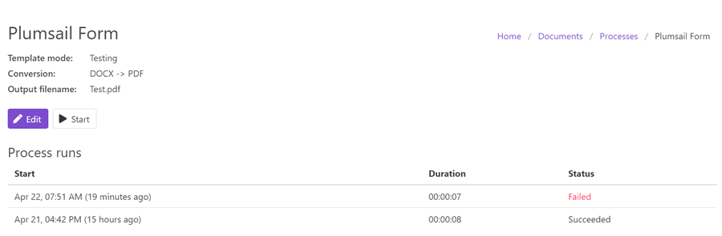
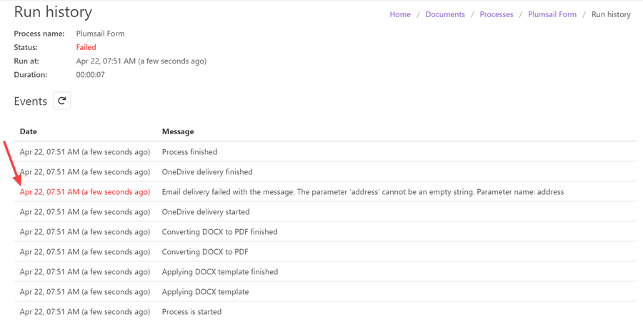

Runs history
============

Every time a process runs, this information is recorded and stored in runs history. 

Runs history of a process shows:
 
- the time it was started, 
- duration,
- and the result status - succeeded or failed. 

You can check a particular run by clicking on it. On this page, you'll see all the steps shown in the chronological order. 

It's especially helpful in case the process has failed. You will see the step where and why it happened. That's why you should have no difficulty in resolving the issue.

.. hint:: Check out `ready-to-use Processes examples <./index.html#processes-examples>`_ for a variety of scenarios.