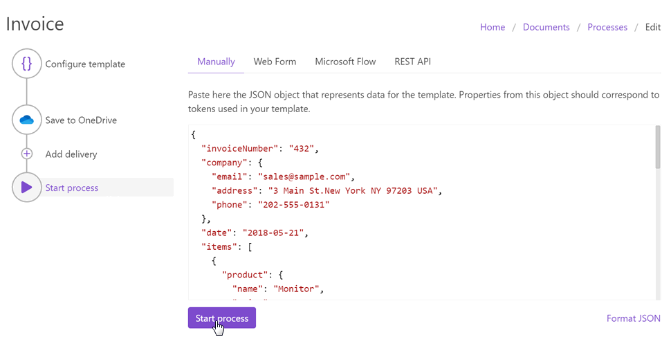

Manually
========

You can start the Process manually right from the step "Start process". 

For that, you need to insert the JSON object representing data for the template like in the picture below.

If you have tested the template on `the step "Configure template" <test-template.html>`_, that data is saved here. Make changes if you need them. 

.. important:: Properties from this object should correspond to tokens used in your template. 

Then, press the Start Process button. Soon you will be redirected to the `run history page <runs-history.html>`_. 