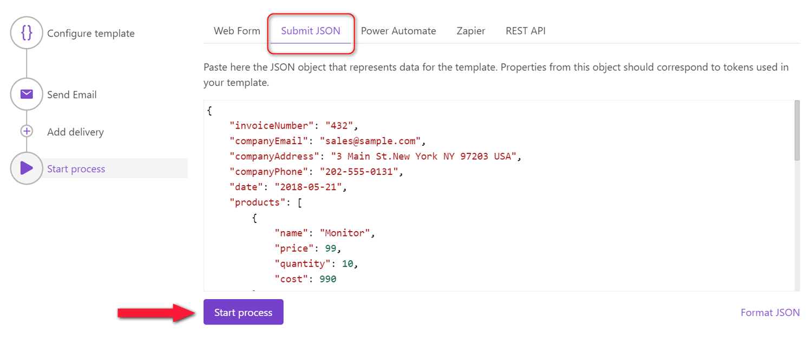

Submit JSON
===========

You can start the Process manually by submitting the JSON object representing data for the template.

.. important:: Properties from this object should correspond to tokens used in your template. 

Then, press the Start Process button. Soon you will be redirected to the `run history page <runs-history.html>`_. 