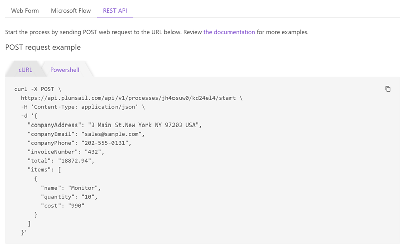
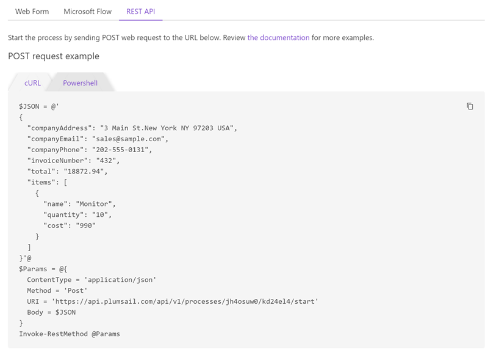

REST API
========

You can start a process using the REST API. Just open the "Start process" step and navigate to the "REST API" tab.

.. contents:: Start process using
  :local:

cURL
----

You can quickly test the REST API using `curl <https://curl.haxx.se>`_. Just copy the command sample from the "cURL" tab and replace the JSON object in the :code:`-d` parameter with your data. Then execute it using curl.

PowerShell
----------

You can quickly test the REST API using PowerShell. Just copy the code sample from the "PowerShell" tab and replace the :code:`$JSON` variable with your data. Then execute it using the command line or `PowerShell ISE <https://docs.microsoft.com/en-us/powershell/scripting/components/ise/introducing-the-windows-powershell-ise>`_.

Your programming language
-----------------------------

In a production environment you may prefer using your programming language for starting processes.

Our API is REST-based. Thus, you can use any programming language that can execute web requests. For example, you would use C#, node.js, Python, PHP.

There are a lot of ready to use helper REST API clients for those languages. Here are just a few of them:

- `RestSharp <http://restsharp.org/>`_ for C#
- `request <https://www.npmjs.com/package/request>`_ - Simplified HTTP client for node.js
- `Requests: HTTP for Humans <http://docs.python-requests.org>`_ for Python
- `Guzzle <http://guzzle.readthedocs.io>`_ for PHP

Just review the structure of the HTTP request in the *curl* sample above and compose a request using your programming language.

.. note:: 

  In addition to starting processes, Plumsail Documents API provides many more operations. Review the `API reference <https://api.plumsail.com/swagger/index.html?urls.primaryName=Documents>`_ and `documentation <../../getting-started/use-as-rest-api.html>`_.

  Also, you can start your process using `Web form <start-process-web-form.html>`_ or `Power Automate (Microsoft Flow) <start-process-ms-flow.html>`_.