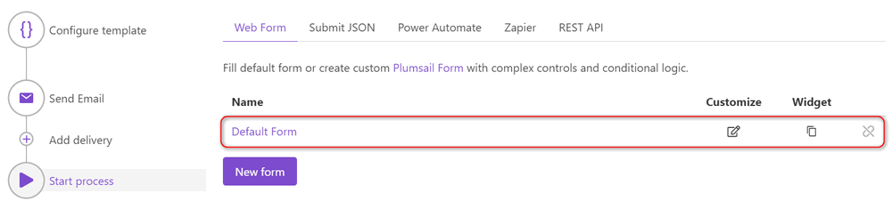
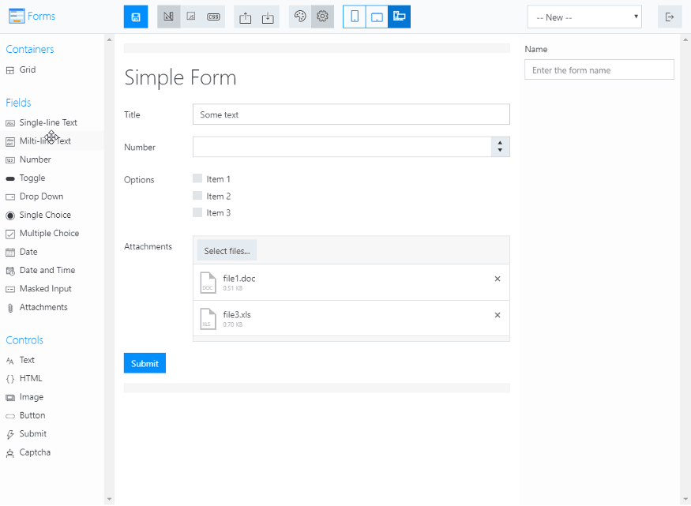

Web form
========

You can start your process by submitting a web form.  
You can either utilize the auto-generated form or create a new form using `Plumsail Forms <https://plumsail.com/forms/>`_.

.. contents::
  :local:

Use auto-generated form
~~~~~~~~~~~~~~~~~~~~~~~

The process pulls tokens from your document template and creates a web form based on them. This auto-generated form will stay bound to the process. 

You can modify it a bit and make it more user-friendly by changing token types. 

Find out how to `change types of template tokens to customize the default form <./custom-testing-form.html>`_.

You can share the form’s link or use the widget to publish it on the website. And every time somebody submits the form, the process will run.

Create custom form using Plumsail Forms
~~~~~~~~~~~~~~~~~~~~~~~~~~~~~~~~~~~~~~~~

Another option is to `customize the auto-generated form or create a new web form using Plumsail Forms <./custom-plumsail-form.html>`_. 

`Plumsail Forms <https://plumsail.com/forms/>`_ allows you to create public forms with complex controls and conditional logic. It has a handy web designer with drag-and-drop:

.. note:: Also, you can start your process using `Zapier <./start-process-zapier.html>`_ or `Power Automate (Microsoft Flow) <start-process-ms-flow.html>`_.