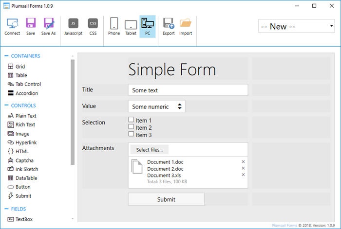
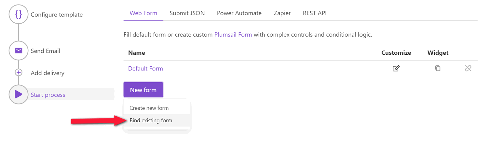
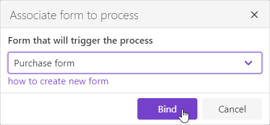
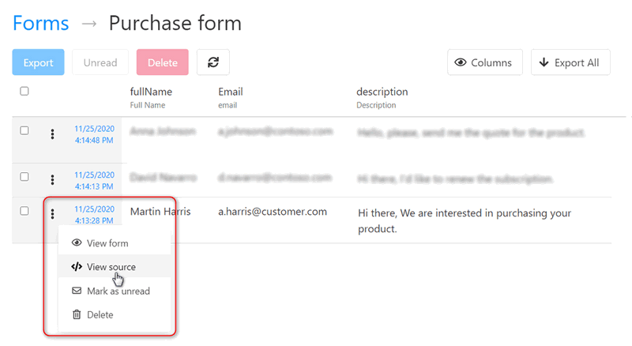

Web form
========

.. contents:: Table of contents
  :local:

Introduction
------------

You can start your process by submitting a public `Plumsail Form <https://plumsail.com/forms/>`_. It is another Plumsail product that allows you designing forms using drag and drop user interface.

This is how the designer of forms looks:

.. Note:: Learn more about public Plumsail Forms in our `documentation <https://plumsail.com/docs/forms-web/introduction.html>`_ and `start designing forms <https://plumsail.com/docs/forms-web/design.html>`_.

Bind form to process
--------------------

Once you created your first form you can associate it with your process. The process will be started after each form submission. Just click "Bind form" button:

Then select the form you created earlier in the dialog:

You can bind a few forms to the same process. Any of those forms will start the process.

Understand the structure of data sent by a form
-----------------------------------------------

The form sends JSON data to the process when it is submitted. This data will be applied to your template. It is crucial to understand the structure of this JSON object to create the correct document template.

Each control and field that you added to your form has an internal name. This internal name will represent the property in the JSON object submitted by your form. You can change it in the designer like this:

.. image:: ../../_static/img/user-guide/processes/change-internal-name-forms.png
    :alt: Change internal name

You can see the full JSON object submitted by a form in `form submissions <https://account.plumsail.com/forms/forms>`_. Just click on your form and expand any of the items:

Use properties from this JSON object when `creating your template <create-template.html>`_.

.. note:: Also, you can start your process using `Microsoft Flow <start-process-ms-flow.html>`_ or `REST API <start-process-rest-api.html>`_.