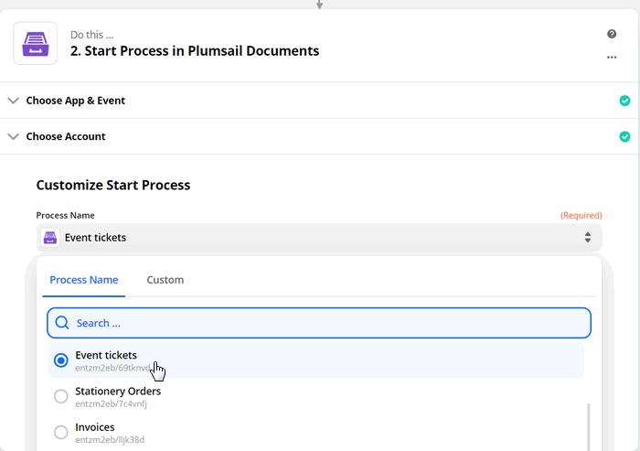
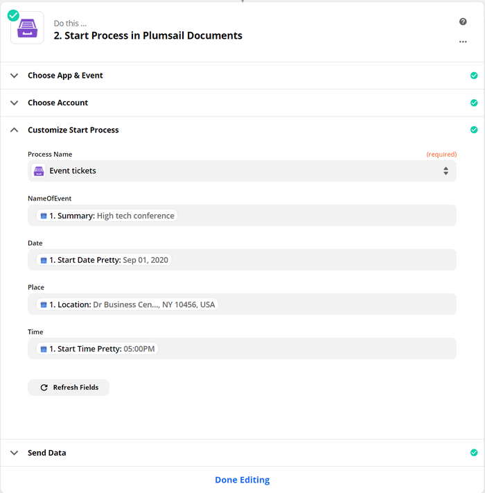
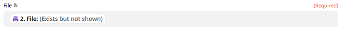

Zapier
======

You can use `Zapier integration <https://zapier.com/apps/plumsail-documents/integrations>`_ to start the process of generating documents from template.

`Zapier <https://zapier.com/>`_ allows you to connect the document generation process with other web applications. It's quite easy to handle automated connections in Zapier - zaps - to get your paperwork done automatically. 

.. contents::
    :local:
    :depth: 2

Use ready zap templates
-----------------------

There are various ready-to-use zap templates you can go to right from the step *Start process*. Just hit *Use this Zap*. You'll be redirected to your Zapier account to personalize this particular zap. Learn how to `customize Start Process in Plumsail Documents action <#customize-start-process>`_.

|Widget|

.. |Widget| raw:: html

   

Or you can create your own zap to start the process. 

Create zap to start process in Zapier
-------------------------------------

We'll take a look at a simple zap to show how to use Start process action in Zapier. 

Let us say you have a Google Calendar for conferences. You need to generate personalized invitations. 

This is how our Zap looks:

.. image:: ../../_static/img/user-guide/processes/sample-zap.png
    :alt: sample zap

Set trigger
~~~~~~~~~~~

The first step is a trigger. In this particular case, it's a new event in the Google Calendar. 

When a new event is added to the Google Calendar, the process of generating tickets for this event will start.

Start Process in Plumsail Documents
~~~~~~~~~~~~~~~~~~~~~~~~~~~~~~~~~~~

After setting a trigger, add an action Start process. For that, search for Plumsail Documents, choose an action Start Process.

.. image:: ../../_static/img/user-guide/processes/zapier-start-process-action.png
    :alt: sample zap

Click Continue. If this is your first Zap, at this point, you'll need to Sign in to your `Plumsail Account <https://auth.plumsail.com/account/login>`_ from Zapier to establish a connection between the app and your account. If you already have a Plumsail account tied to the app, you can add another one at this step, and use it instead.

Customize Start Process
~~~~~~~~~~~~~~~~~~~~~~~

Choose the process you want to start by this Zap from the dropdown. 

Once you did it, you'll see fields to complete. They will have the same name as tokens from the template. Actually, they're created based on them. 

.. note:: If the fields to complete didn't appear after selecting the process to monitor, go to this process in the Plumsail account and re-save the document template on the Configure template step.

Use the output from the trigger to specify values:

Use the result file in Zapier
-----------------------------

It's possible to use the output of the Start process action further in the zap. 

You'll be able to add the result file as an attachment:

Process finished trigger
-------------------------

Sometimes you need to do some actions when a `process <../../user-guide/processes/index.html>`_ of document generation is finished.

You can use trigger `Process finished <https://plumsail.com/docs/documents/v1.x/flow/actions/document-processing.html#triggers-when-a-process-is-finished>`_ .

It checks if the selected process is finished and returns an URL of the result file.
For example, `Process finished <https://plumsail.com/docs/documents/v1.x/flow/actions/document-processing.html#triggers-when-a-process-is-finished>`_ returns an URL to a generated contract and you can send email with the result file URL as attachment in the Zapier flow.

