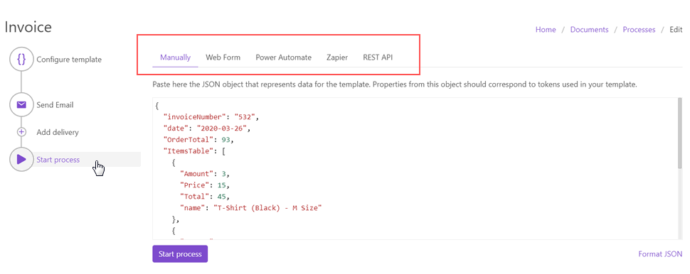

Start process
=============

Now, when you configured `document template <create-template.html>`_ and `deliveries <create-delivery.html>`_ you can start generating your documents. Click on the "Start process" button on the left side of your process. It will show you five tabs with instructions describing five ways to start your process:

.. toctree::   
  :caption: Learn how to use each of them:
  :name: toc-start-process  
  :maxdepth: 1

  start-process-manually  
  start-process-web-form
  start-process-ms-flow
  start-process-zapier
  start-process-rest-api

.. note:: After you have started the process, you can check its `runs history <runs-history.html>`_.