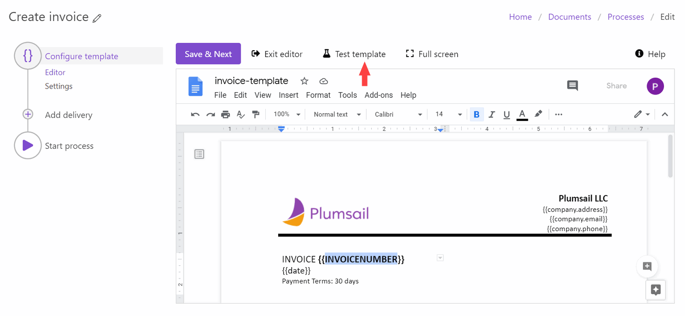

Test template with your data
=============================

.. contents::
  :local:

You can test the document template to see an example of the resulting file from the Editor and Settings substeps of the Configure template step. 

Testing from the editor
~~~~~~~~~~~~~~~~~~~~~~~

The first option – testing from the Editor substep – will help to see how your modifications to the template affect the result.

Testing from the settings
~~~~~~~~~~~~~~~~~~~~~~~~~

The second option – testing from the Settings substep – will show you how the finalized document will look after you’ve customized all the settings. 

.. image:: ../../_static/img/user-guide/processes/test-template-from-settings.png
    :alt: Test template from settings step

What to do after you clicked on the Test template?
~~~~~~~~~~~~~~~~~~~~~~~~~~~~~~~~~~~~~~~~~~~~~~~~~~

After that, you will see the dialog with two options for testing the template - `Fill the form`_ and `Submit JSON`_.

Fill the form
-------------

The process creates a testing form based on tokens from the template. 
You just complete it and press 'Create document'. The resulting document will appear in a new tab. 

.. image:: /_static/img/user-guide/processes/default-test-form.png
   :alt: default form fields

It's possible to `adjust the testing form by changing token types <./customize-forms.html>`_.

.. important:: Nesting tokens referring to the single object, not the collection of items, won't work in the testing form. Thus, if you have some nesting tokens like :code:`{{company.name}}`, :code:`{{company.address}}`, get rid of a dot operator and change them to simple tokens like :code:`{{companyName}}` and :code:`{{companyAddress}}`. Alternatively, you can **keep them** and `submit JSON`_ for testing the template.

Submit JSON
-----------

Insert the JSON object representing the data for the document template and click on the 'Create document' button. This type of testing may be useful if your document template is complex or you already have JSON output from third systems.

.. image:: /_static/img/user-guide/processes/template-test-dialog.png
   :alt: default form fields

.. Note:: Once you tested the template you can `configure how to deliver the result document <create-delivery.html>`_ (email, OneDrive, etc). Just click the *Save & Next* button in the *Configure template* step.