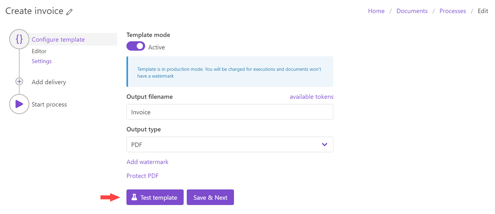

Test template with your data
=============================

You can test the document template to see an example of the resulting file from the Editor and the Settings steps. 

The first option – testing from the Editor step – will help to see how your changes affect the result.

.. image:: ../../_static/img/user-guide/processes/test-template-from-editor.png
    :alt: Test template from editor step

The second option – testing from the Settings step – will show you how the finalized document will look after you’ve customized all the settings. 

**What to do after you clicked on the Test template?**

After that, you will see the dialog where you can put your data in JSON format:

Just click *Create document* to apply this data to your template and review the resulting document.

.. Note:: Once you tested the template you can `configure how to deliver the result document <create-delivery.html>`_ (email, OneDrive, etc). Just click the *Save & Next* button in the *Configure template* step.